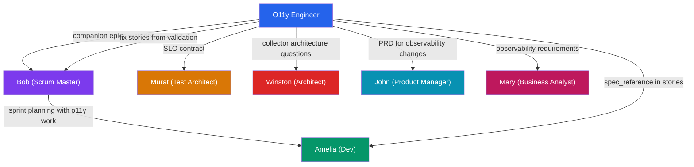
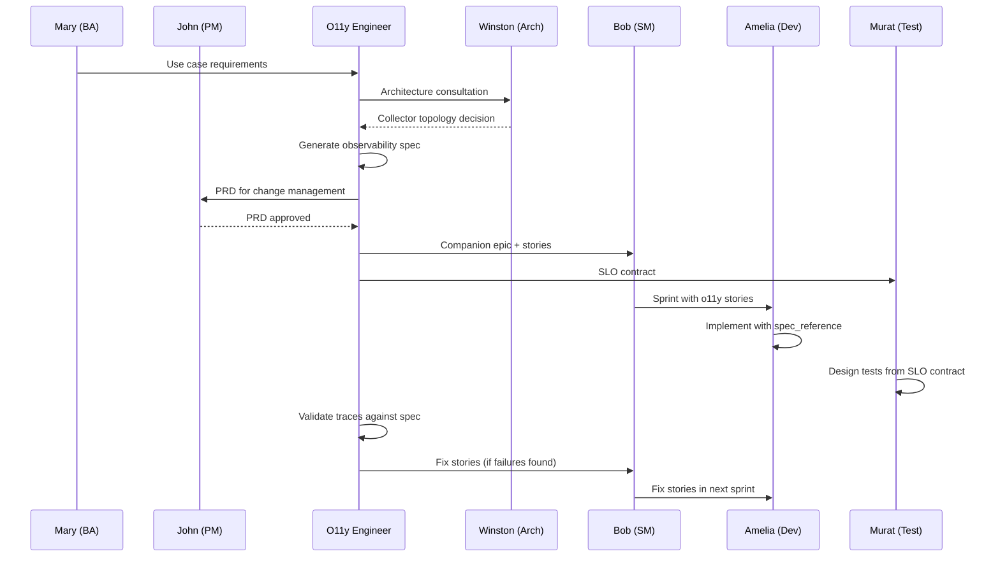

# B-MAD Agent Integration

The O11y Engineer collaborates with the default B-MAD agents. This page documents how each agent interacts with observability workflows, what artifacts are exchanged, and when handoffs occur.

## Interaction Overview



---

## Bob (Scrum Master)

**Role:** Receives companion epics and stories, plans sprints that include observability work, routes fix stories from validation failures.

### Artifacts Sent to Bob

| Artifact | Trigger | Location |
|----------|---------|----------|
| Companion epic with stories | `generate-observability-spec` | `_bmad-output/epics/` |
| Fix stories from validation | `validate-traces` | Appended to existing epic |
| Observability change epic | `plan-observability-change` | `_bmad-output/epics/` |

### How Bob Uses These

- **Sprint planning:** Picks up observability stories alongside feature stories, prioritizing by SLO impact
- **Fix story routing:** Adds validation fix stories to the current sprint backlog
- **Status tracking:** Updates story status through the sprint

!!! note
    All stories use the standard BMAD story format. Bob does not need any special handling.

---

## Amelia (Dev)

**Role:** Implements instrumentation stories, follows attribute ownership maps, validates locally.

### Artifacts Provided to Amelia

| Artifact | Purpose | Key Fields |
|----------|---------|------------|
| Instrumentation stories | Implementation tasks | `spec_reference`, `test_criteria` |
| Observability spec | Reference document | Trace/log/metric contracts |
| Attribute ownership map | What to instrument where | `app_managed` vs `collector_managed` |

### How Amelia Uses These

**spec_reference:** Links to the exact section of the observability spec. Amelia uses this to understand which spans to create, which logs to emit, and which metrics to record.

**Attribute ownership:** Three categories:

- **app_managed_attributes** -- Amelia must set these in application code
- **collector_managed_attributes** -- Set by the collector; Amelia should NOT set these
- **redacted_attributes** -- PII fields the collector will redact

!!! tip
    Always check the `attribute_ownership` section before instrumenting. Setting collector-managed attributes in application code creates duplicates.

---

## Murat (Test Architect)

**Role:** Receives SLO contracts for test design, implements assertions matching SLO targets.

### Artifacts Provided to Murat

| Artifact | Purpose | Location |
|----------|---------|----------|
| SLO contract | Test design targets | `observability-specs/slo-contract.yaml` |
| Test type mapping | Which test per KPI | Embedded in SLO contract |
| Validation reports | Coverage gaps | `_bmad-output/o11y-artifacts/reports/` |

### SLO-to-Test Mapping

- **Performance KPIs** (latency) -> **load test** assertions
- **Reliability KPIs** (error rate) -> **soak test** assertions
- **Availability KPIs** (uptime) -> **chaos test** and **synthetic** assertions

Each SLO entry includes a `test_assertion` field:

```yaml
test_assertion: "p95_latency_ms < 500"
```

!!! warning
    SLOs must be explicitly approved (`approved: true`) before Murat generates test stories.

See [SLO Contract](slo-contract.md) for the full contract format.

---

## Winston (Architect)

**Role:** Consulted on collector architecture decisions, pipeline design, system-wide strategy.

### When O11y Engineer Consults Winston

| Decision | Context |
|----------|---------|
| Collector deployment topology | Agent vs gateway vs sidecar |
| Pipeline design | Multi-tenant, fan-out configurations |
| Resource budgets | Cluster resources for observability |
| Technology selection | Collector components with broad impact |

---

## John (Product Manager)

**Role:** Owns PRD creation for observability changes, manages change management workflow.

### Change Management Flow

1. O11y Engineer identifies need for change
2. John creates/approves PRD at `_bmad-output/prd/`
3. O11y Engineer generates companion epic
4. Bob plans the sprint
5. Amelia implements

!!! note
    The O11y Engineer will never implement observability changes without a PRD.

---

## Mary (Business Analyst)

**Role:** Provides requirements for observability use cases, ensures stakeholder alignment.

### Collaboration

Mary helps define the **use cases** section of observability specs:

```yaml
use_cases:
  - question: "What is the p95 latency for checkout?"
    signal: traces
    answer_method: "Filter spans by service + operation, compute p95 duration"
```

Mary validates that these questions align with business stakeholder expectations.

---

## Interaction Flow


