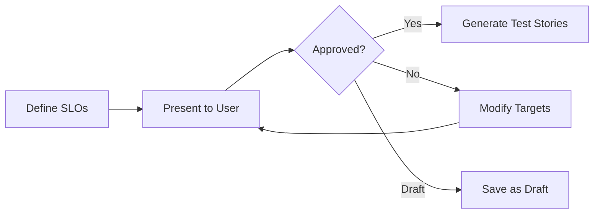

# SLO Contract

The SLO contract is the handoff artifact between the O11y Engineer and the Test Architect (Murat). It defines measurable KPIs that translate directly into test assertions.

## Contract Format

```yaml
metadata:
  service: "registration-service"
  version: "1.0"
  created_by: "o11y-engineer"
  approved: true          # MUST be true for test generation
  approved_by: "user"
  approved_at: "2026-01-30T10:00:00Z"

performance_kpis:
  - id: perf-001
    name: "Registration Latency"
    description: "End-to-end registration request latency"
    signal: traces
    measurement:
      dql: |
        fetch spans
        | filter service.name == "registration-service"
        | filter span.name == "POST /api/register"
        | filter span.kind == "SERVER"
        | summarize p95=percentile(duration, 95)/1000000
      metric: "http.server.request.duration"
    target:
      p50: 200   # ms
      p95: 500   # ms
      p99: 1000  # ms
    test_type: load_test
    test_assertion: "p95_latency_ms < 500"
    use_case_ref: "uc-001"

reliability_kpis:
  - id: rel-001
    name: "Registration Success Rate"
    description: "Percentage of successful registrations"
    signal: metrics
    measurement:
      dql: |
        timeseries {
          success=sum(registration.success.total),
          errors=sum(registration.error.total)
        }, interval:5m
        | fieldsAdd rate=(success[]/(success[]+errors[]))*100
      metric: "registration.success.total / total"
    target:
      success_rate: 99.9
      error_budget_monthly: 0.1
    test_type: soak_test
    test_assertion: "success_rate > 99.9"
    use_case_ref: "uc-002"

availability_kpis:
  - id: avail-001
    name: "Service Uptime"
    description: "Service availability via health checks"
    signal: synthetic
    measurement:
      method: "HTTP health check every 60s"
      endpoint: "/health"
    target:
      uptime: 99.95
      max_downtime_monthly: "21m 54s"
      recovery_time: 300  # seconds
    test_type: chaos_test
    test_assertion: "uptime_percentage > 99.95"
```

## Field Reference

### Metadata

| Field | Type | Description |
|-------|------|-------------|
| `service` | string | Service name |
| `version` | string | Contract version |
| `approved` | boolean | Must be `true` for test generation |
| `approved_by` | string | Who approved the targets |
| `approved_at` | timestamp | When approved |

### KPI Fields

| Field | Type | Description |
|-------|------|-------------|
| `id` | string | Unique KPI identifier |
| `name` | string | Human-readable name |
| `signal` | string | traces, metrics, logs, or synthetic |
| `measurement.dql` | string | DQL query to measure the KPI |
| `target` | object | Target values (thresholds) |
| `test_type` | string | load_test, soak_test, chaos_test, or synthetic |
| `test_assertion` | string | Machine-readable assertion for test frameworks |
| `use_case_ref` | string | Link to observability spec use case |

## How the Test Architect Uses This

### KPI-to-Test Mapping

| KPI Type | Test Type | Framework |
|----------|-----------|-----------|
| Performance | Load test | k6, Artillery, Gatling |
| Reliability | Soak test | k6 (extended duration) |
| Availability | Chaos test | Litmus, Chaos Mesh |
| Availability | Synthetic | Dynatrace Synthetic, Playwright |

### Assertion Examples

**Load test (k6):**
```javascript
export const options = {
  thresholds: {
    'http_req_duration{name:registration}': ['p(95)<500'],
  },
};
```

**Soak test assertion:**
```javascript
check(res, {
  'success rate > 99.9%': (r) => successRate > 99.9,
});
```

## Approval Workflow



SLOs in draft state (`approved: false`) are proposals only. They are visible but do not trigger test story generation.
