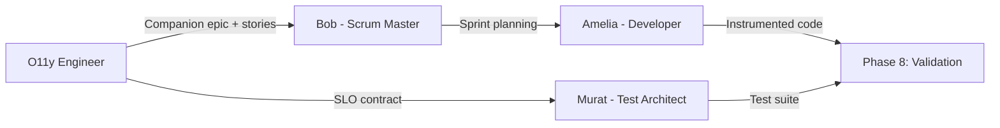

# Phase 7: Implementation

**Trigger:** Handoff to sprint planning

**Goal:** Hand off observability stories to the B-MAD agent ecosystem for implementation.

## How It Works

The O11y Engineer does not implement code directly. Instead, it generates stories in BMAD standard format and hands them off to the multi-agent team:



## Agent Roles

### Bob (Scrum Master)

- Receives companion epics from `generate-observability-spec`
- Receives fix stories from `validate-traces`
- Plans sprints mixing observability stories with feature work
- Prioritizes based on SLO impact and production readiness score

### Amelia (Developer)

- Implements instrumentation stories
- References the observability spec via `spec_reference` in each story
- Follows the attribute ownership map (app_managed vs collector_managed)
- Validates locally using `test_criteria`

### Murat (Test Architect)

- Receives the SLO contract from `define-slos`
- Designs tests mapping each KPI to its test type
- Uses `test_assertion` fields for assertion generation
- Only works with approved SLOs (`approved: true`)

## Story Format

All stories generated by the O11y Engineer use BMAD standard format:

```yaml
title: "Instrument registration endpoint with OTel spans"
type: instrumentation
acceptance_criteria:
  - "POST /api/register produces a SERVER span"
  - "Span includes http.route, http.method, http.status_code attributes"
  - "Child span created for database INSERT operation"
spec_reference: "observability-specs/registration-spec.yaml#trace_contracts.spans[0]"
test_criteria:
  assertion: "span.name == 'POST /api/register' AND isNotNull(http.route)"
  dql_query: |
    fetch spans
    | filter service.name == "registration-service"
    | filter span.name == "POST /api/register"
    | limit 1
```

Stories are stored at `_bmad-output/epics/`.

## Cross-Agent Integration

See [B-MAD Agent Integration](../integration/bmad-agents.md) for detailed documentation on how each agent consumes observability artifacts.

## Next Step

After implementation is complete, proceed to [Phase 8: Validation](phase-8-validation.md) to verify that actual telemetry matches the spec.
