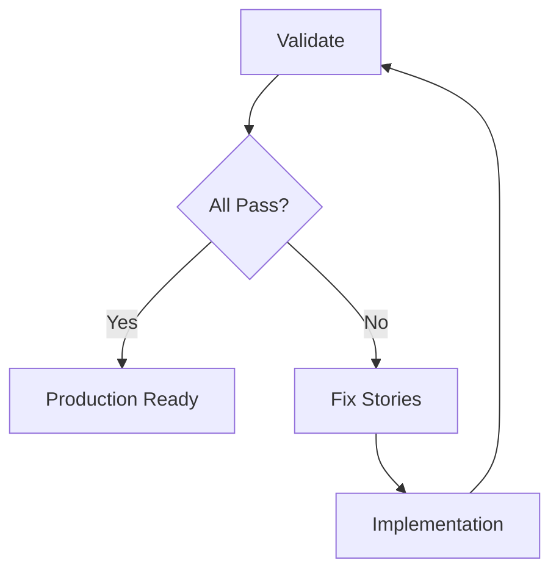

# Phase 8: Validation

**Command:** `*validate-traces`

**Goal:** Verify that actual traces, metrics, and logs match the observability spec. Produce validation reports and generate fix stories for gaps.

## The 5-Step Query Validation Gate

Before concluding any span, metric, or log is missing, the agent MUST run this mandatory validation gate:

| Step | What It Checks | Why |
|------|---------------|-----|
| 1 | Service name | Names may differ due to prefixes/casing |
| 2 | Namespace/environment | Ensure correct deployment scope |
| 3 | Time window | Service must be actively receiving traffic |
| 4 | Span names | Framework conventions may affect naming |
| 5 | Attribute existence | Confirm attributes are populated |

!!! danger "Never Skip"
    The Query Validation Gate prevents false negatives. A "missing span" conclusion is only valid after all 5 steps pass.

## Validation Process

### Phase A: Load Spec

Read the observability spec from `observability-specs/{service}-spec.yaml`.

### Phase B: Run Query Validation Gate

Execute each of the 5 steps to confirm the data source is accessible and correctly scoped.

### Phase C: Validate Contracts

For each contract type:

**Trace Contracts:**

- Span existence (PASS/FAIL)
- Required attributes (PASS/FAIL per attribute)
- Attribute value types
- Parent-child relationships

**Log Contracts:**

- Required fields exist
- trace_id correlation
- Log level compliance

**Metric Contracts:**

- Metric existence
- Dimension matching
- Metric type (counter/histogram/gauge)

**Correlation Contracts:**

- Trace-to-log correlation percentage
- Cross-service propagation

### Phase D: Generate Reports

Dual-format reports:

**Human-readable** (`_bmad-output/o11y-artifacts/reports/{service}-validation-{date}.md`):

```markdown
# Observability Validation Report
## Service: registration-service
## Overall Status: PARTIAL (18/22 passed)

### Failures
| Contract | Expected | Actual | Severity |
|----------|----------|--------|----------|
| trace: POST /api/register child span | db.query INSERT users | Not found | HIGH |
| log: trace_id correlation | 100% | 73% | MEDIUM |
```

**Machine-readable** (`_bmad-output/o11y-artifacts/reports/{service}-validation-{date}.yaml`)

### Phase E: Generate Fix Stories

For each failure:

- Create a fix story in BMAD standard format
- Include `spec_reference` pointing to the failed contract
- Include `test_criteria` with the DQL query that should pass
- Include language-specific fix suggestions
- Rate severity: CRITICAL (SLO-impacting), HIGH (spec violation), MEDIUM (best practice)

## Failure Severity

| Severity | Meaning | Action |
|----------|---------|--------|
| CRITICAL | SLO-impacting, data loss | Immediate fix, blocks release |
| HIGH | Spec violation, missing contracts | Fix in current sprint |
| MEDIUM | Best practice deviation | Fix in next sprint |
| LOW | Minor improvement | Backlog |

## Iteration

After fix stories are implemented (Phase 7), run validation again:



## Next Step

If all validations pass, the service has production-grade observability. If not, fix stories feed back into [Phase 7: Implementation](phase-7-implementation.md).
