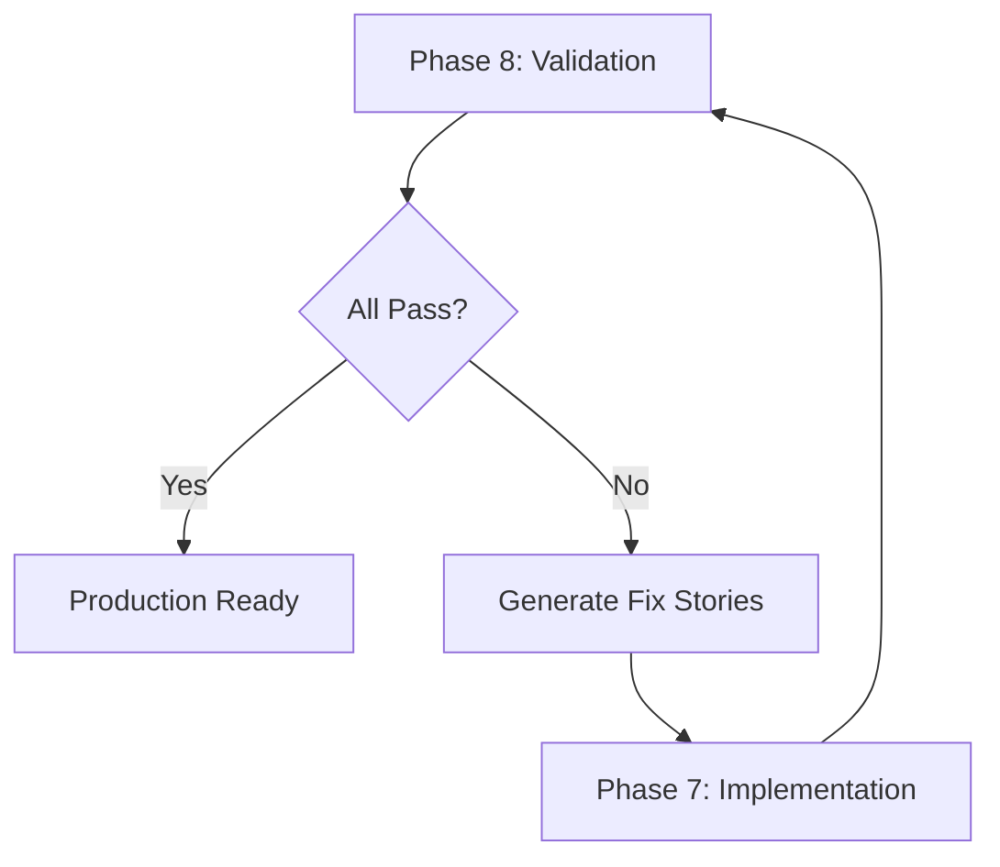

# Recommended 8-Phase Workflow

The O11y Engineer follows an 8-phase workflow to take a project from zero to production-grade observability. Each phase builds on the previous one.

## Workflow Overview

## Phase Summary

| Phase | Name | Command | Output |
|-------|------|---------|--------|
| 1 | [Assessment](phase-1-assessment.md) | `*assess-observability` | Maturity score, gap analysis, roadmap |
| 2 | [Observability Spec](phase-2-spec.md) | `*generate-observability-spec` | Spec file + companion epic |
| 3 | [Collector Config](phase-3-collector.md) | `*configure-pipeline` | Collector YAML, processor ordering |
| 4 | [CI/CD with Weaver](phase-4-cicd.md) | `*validate-semconv` | Weaver config, CI pipeline |
| 5 | [SLO Definition](phase-5-slos.md) | `*define-slos` | SLO contract, test stories |
| 6 | [MCP Rules](phase-6-mcp-rules.md) | `*configure-mcp-rules` | IDE rule files with DQL |
| 7 | [Implementation](phase-7-implementation.md) | Sprint planning handoff | Stories assigned to dev agents |
| 8 | [Validation](phase-8-validation.md) | `*validate-traces` | Validation report, fix stories |

## Phase Details

### Phase 1: Assessment

**Goal:** Understand the current state of observability in the project.

The assessment scans existing instrumentation, collector configuration, and monitoring setup to produce a maturity score (0-100) and a prioritized improvement roadmap.

**Key questions answered:**

- What signals are being collected? (traces, metrics, logs)
- Is the collector configured correctly?
- Are semantic conventions followed?
- Is the setup production-ready?

### Phase 2: Observability Spec

**Goal:** Define what telemetry each service should produce and why.

The spec is a use-case-driven document that serves as a contract between development and operations. It defines trace contracts, log contracts, metric contracts, and correlation contracts.

**Key outputs:**

- `observability-specs/{service}-spec.yaml`
- Companion epic with instrumentation stories

### Phase 3: Collector Configuration

**Goal:** Design and configure the OpenTelemetry Collector pipeline.

This phase covers receiver selection, processor ordering (memory_limiter first, batch last), resource enrichment, PII cleanup, and exporter configuration.

**Key decisions:**

- VM/bare-metal: Use resourcedetectionprocessor
- Kubernetes: Use k8sattributesprocessor
- PII concerns: Use transform processor with OTTL
- Dynatrace backend: Use cumulativetodeltaprocessor

### Phase 4: CI/CD with Weaver

**Goal:** Integrate OpenTelemetry Weaver into the CI/CD pipeline for automated semantic convention validation.

Weaver ensures that any telemetry changes are validated against the defined semantic conventions before they reach production.

### Phase 5: SLO Definition

**Goal:** Define performance, reliability, and availability targets based on the observability spec.

SLOs are presented for user approval before generating test stories. Each SLO maps to a specific test type (load, soak, chaos, synthetic) for the Test Architect.

### Phase 6: MCP Rules

**Goal:** Generate IDE-specific rule files that embed Dynatrace DQL queries.

Rule files are placed in the project directory according to IDE conventions (Claude Code, Cursor, Windsurf, Copilot, Amazon Q).

### Phase 7: Implementation

**Goal:** Hand off to the B-MAD agent ecosystem for implementation.

The O11y Engineer generates stories in BMAD standard format. Bob (Scrum Master) plans sprints, Amelia (Dev) implements instrumentation, and Murat (Test Architect) designs tests from the SLO contract.

### Phase 8: Validation

**Goal:** Verify that actual telemetry matches the observability spec.

The validation workflow runs the mandatory 5-step Query Validation Gate before concluding any span/metric/log is missing. It produces dual-format reports (human-readable markdown + machine-readable YAML) and generates fix stories for failures.

## When to Skip Phases

| Scenario | Start At |
|----------|----------|
| Greenfield project, no observability | Phase 1 |
| Existing observability, needs improvement | Phase 1 |
| Collector already configured | Phase 2 |
| Specs already defined | Phase 3 |
| Ready for SLOs | Phase 5 |
| Need to validate existing setup | Phase 8 |

## Iteration

The workflow is iterative. After Phase 8 validation:

- **All pass:** Observability is production-ready
- **Failures found:** Fix stories are generated and fed back to Phase 7 for implementation
- **Spec changes needed:** Return to Phase 2 to update specs

